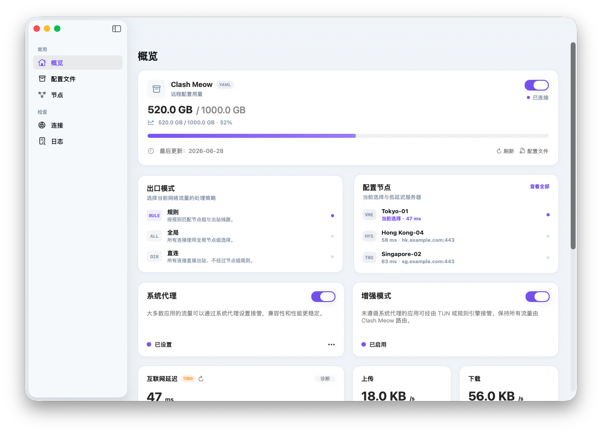

# Clash Meow

  

Clash Meow 是一个原生 macOS 图形应用，用于运行、管理和观察本地 [mihomo](https://github.com/MetaCubeX/mihomo) 内核。

## 功能

- 启动和停止本地 mihomo 内核，管理订阅与本地 YAML 配置。
- 概览页展示内核状态、转发模式、节点、系统代理、增强模式（TUN）与实时流量统计。
- 查看活动连接、客户端流量排行、上传/下载速率曲线。
- 切换流量转发模式：直连、规则、全局。
- 开启或关闭系统代理、TUN、局域网访问等网络选项。

## 更多文档

开发、构建、打包和实现细节见：

[开发文档](docs/development.md)

## 免责声明
- 本项目代码 100% 由 AI Agent 参与生成与修改完成。
- 本项目按“现状（AS IS）”提供，不提供任何形式的明示或默示担保。
- 使用本项目产生的任何后果（包括但不限于网络中断、账号风险、数据丢失、配置错误、系统异常等）由使用者自行承担。
- 作者不对任何直接、间接、附带、特殊或后果性损失承担责任。
- 作者更建议您提交由 AI Agent 生成或修改的代码，而非手写代码，以保持生成过程一致。
